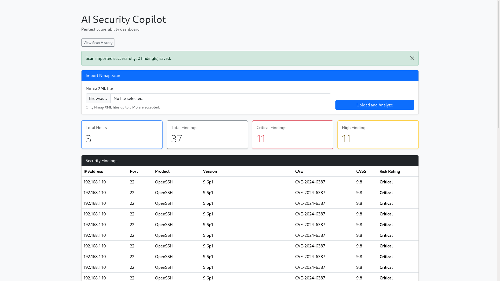
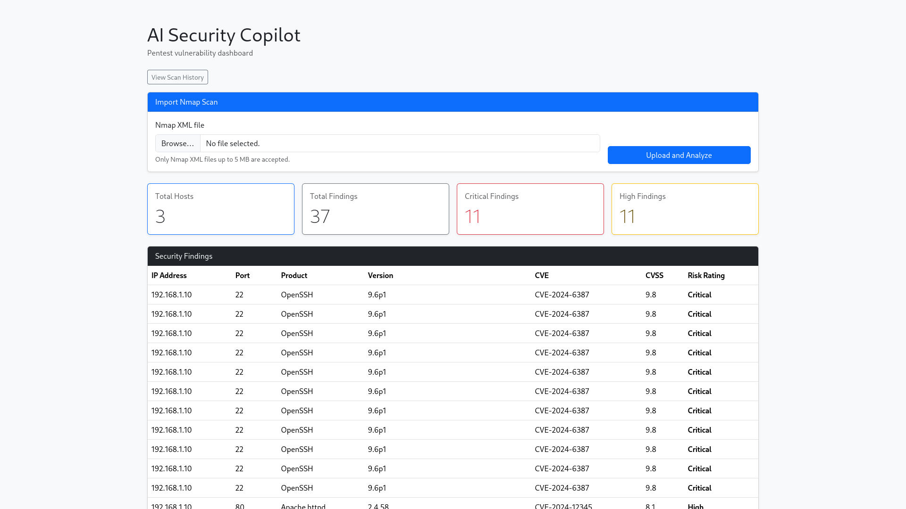
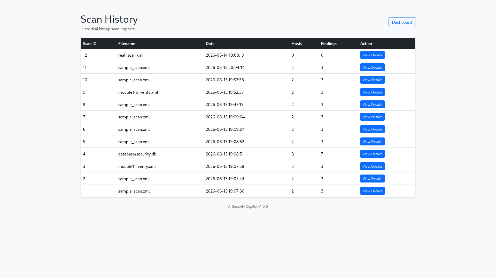
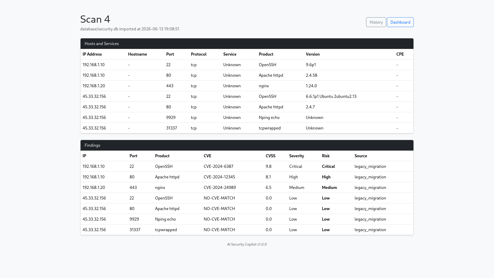
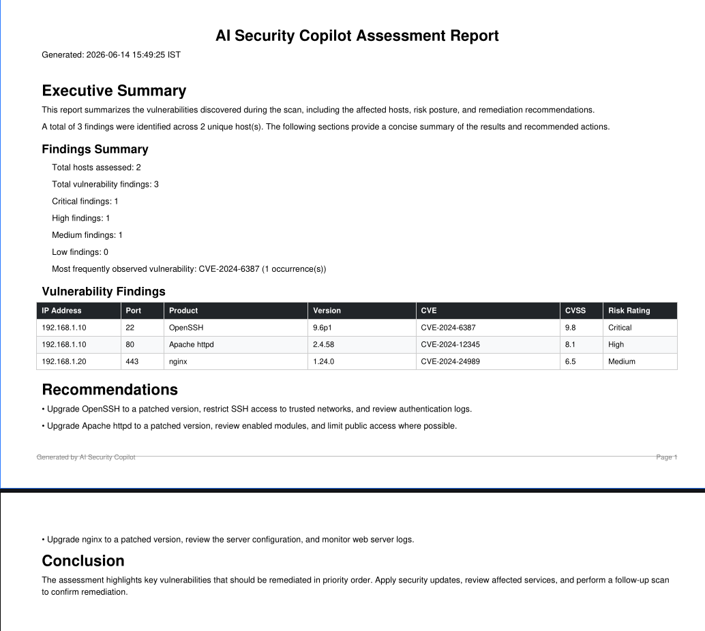

# AI Security Copilot


> Portfolio-grade cybersecurity platform that imports Nmap XML scans, enriches discovered services with CVE intelligence, performs risk assessment, stores scan history, and generates professional security assessment reports.

---

# Overview

AI Security Copilot is a Python-based vulnerability assessment platform designed for cybersecurity students, penetration testers, and security enthusiasts.

The platform automates the workflow from Nmap scan ingestion to vulnerability enrichment, risk assessment, historical scan tracking, and PDF report generation.

Key capabilities include:

* Nmap XML parsing
* CVE intelligence enrichment
* Risk assessment using CVSS
* Historical scan storage
* Dashboard visualization
* PDF report generation
* Automated testing and CI/CD

---

# Features

## Scan Processing

* Nmap XML upload workflow
* XML validation and sanitization
* Host discovery
* Service enumeration
* Historical scan tracking

## Vulnerability Intelligence

* Official NVD API integration
* Local CVE fallback database
* CVE normalization layer
* Source tracking (`nvd`, `local_fallback`, `no_match`)

## Risk Assessment

* CVSS-based scoring
* Low / Medium / High / Critical classifications
* Automated recommendations
* AI-style analyst summaries

## Dashboard

* Flask web interface
* Risk-colored findings
* Historical scan page
* Individual scan details page
* Upload and analysis workflow

## Reporting

* Professional PDF reports
* Executive summary
* Findings section
* Recommendations section
* Risk breakdown

## Engineering

* Automated unit tests
* GitHub Actions CI
* Bandit security scanning
* Configuration management
* Modular architecture

---

# Screenshots

## Upload Workflow




## Dashboard



## Scan History



## Scan Details



## PDF Report



---

# Architecture

```text
Nmap XML Upload
        |
        v
Create Scan Record
        |
        v
XML Parser
        |
        v
Host Discovery
        |
        v
Service Discovery
        |
        v
CVE Provider
   /             \
NVD API     Local Fallback
        |
        v
Risk Engine
        |
        v
AI Analysis
        |
        v
SQLite Database
        |
   +----+----+
   |         |
   v         v
Dashboard   PDF Report
```

Additional documentation:

```text
docs/architecture.md
```

---

# Project Structure

```text
AI-Security-Copilot/
│
├── ai/
├── cve/
├── database/
├── docs/
├── parser/
├── reports/
├── risk/
├── scans/
├── screenshots/
├── scripts/
├── templates/
├── tests/
│
├── app.py
├── config.py
├── version.py
├── requirements.txt
├── requirements-dev.txt
├── pyproject.toml
└── README.md
```

---

# Installation

Clone the repository:

```bash
git clone https://github.com/ritheesh2808/AI-Security-Copilot.git
cd AI-Security-Copilot
```

Create a virtual environment:

```bash
python -m venv venv
source venv/bin/activate
```

Install dependencies:

```bash
pip install -r requirements.txt
```

Validate requirements:

```bash
python scripts/check_requirements.py
```

Initialize the database:

```bash
python database/db.py
```

---

# Running the Application

Start the dashboard:

```bash
python app.py
```

Open:

```text
http://127.0.0.1:5000
```

---

# Usage Workflow

```text
Upload Nmap XML
       ↓
Parse Hosts & Services
       ↓
Lookup CVEs
       ↓
Assess Risk
       ↓
Generate Findings
       ↓
Store in SQLite
       ↓
View Dashboard
       ↓
Generate PDF Report
```

---

# Testing

Run all tests:

```bash
python -m unittest discover -s tests
```

Security scan:

```bash
bandit -r . -x ./venv,./tests
```

Dependency validation:

```bash
python scripts/check_requirements.py
```

---

# Technologies Used

* Python
* Flask
* SQLite
* Nmap
* NVD API
* ReportLab
* Bootstrap 5
* GitHub Actions
* Bandit

---

# Security Notice

This project is intended for educational purposes, cybersecurity learning, research, and authorized security assessments only.

Only scan and assess systems that you own or have explicit permission to test.

---

# Future Roadmap

* User authentication
* Docker deployment
* Gunicorn production deployment
* CISA KEV integration
* EPSS integration
* Scan comparison engine
* Remediation tracking
* Multi-user support
* Local LLM integration (Ollama)

---

# Version

Current Release: **v1.1.0**

---

# Author

**Ritheesh M G**

Cyber Security Engineering Student

GitHub: https://github.com/ritheesh2808

---

# License

Released under the MIT License.
